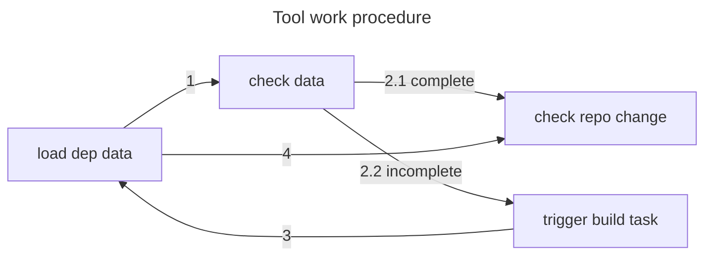
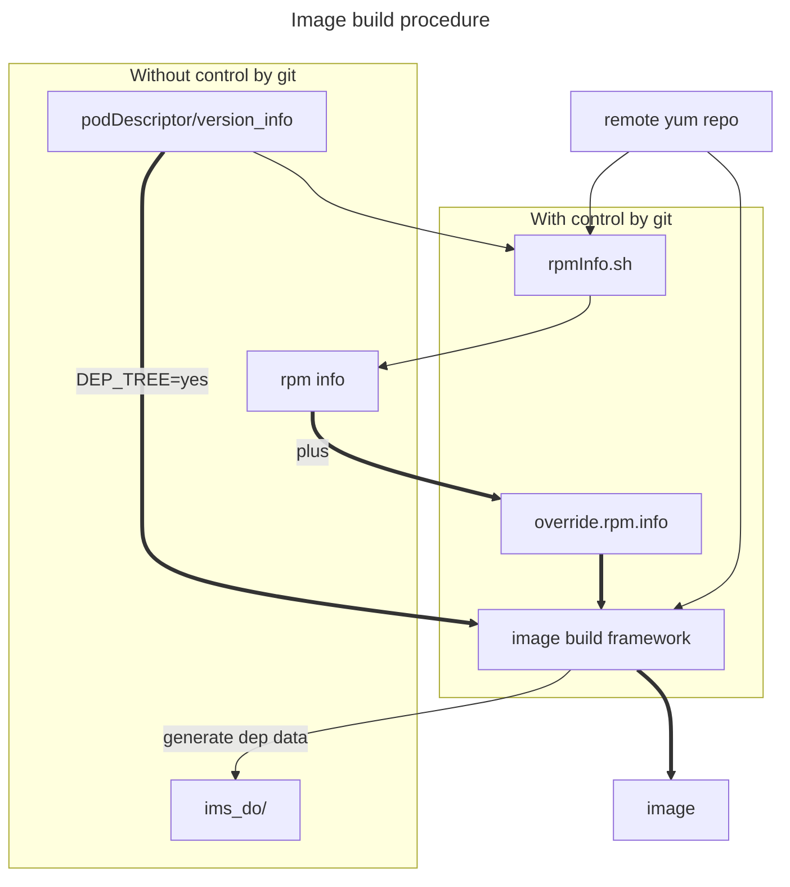
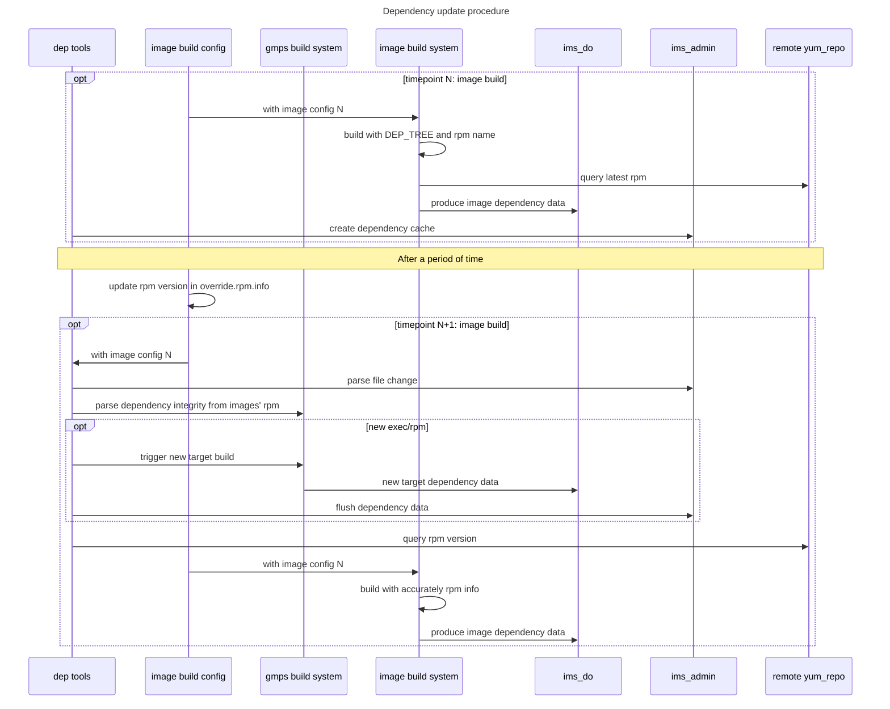
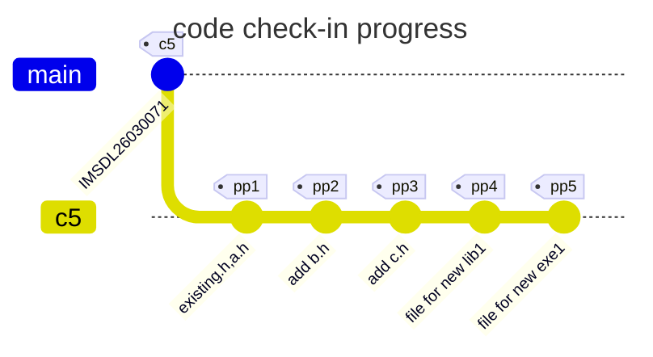
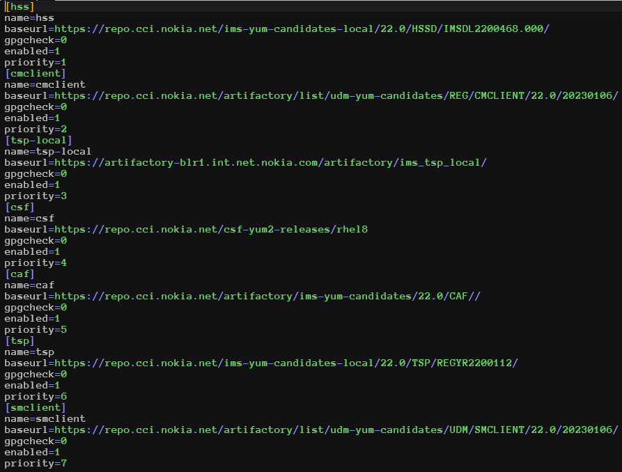

# Dependency generation function introduction
> base on ims_admin (gmps build system) and hss/udm image build framework


## 1 Dependency Generation

### 1.1 Enhencement to gmps(hss) build system
> gmps = shell + perl + imake + make, temporary [ims_admin](https://gitlabe1.ext.net.nokia.com/registers/ims_admin)

#### 1.1.1 Add variables for Customize Project (go)
  Indicate go project path accurately to get dependency data. <br>
  `CUSTOMIZE_PROJECT_TYPE (go)` <br>
  `CUSTOMIZE_PROJECT_PATH (/path/to/go.mod)` <br>
  `CUSTOMIZE_PROJECT_SUBPKG (subpkg/dir)` <br>
  patch: [183139](https://bhimscm51.apac.nsn-net.net:8443/#/c/183139/)

#### 1.1.2 Remove build stage in pkg (with spec file)
  Separate rpm build and lib/bin build, as gmps already has combined target (i.e. phIMSPhdebug+pkg), this can reduce redundant steps and facilitate dependency collection.
  path: [182547](https://bhimscm51.apac.nsn-net.net:8443/#/c/182547/)

#### 1.1.3 Update gmake from 3.81 to 4.2.1
> To fix double-colon rule thread-safe issue.

#### 1.1.4 Build Target Dependency Query
> Use gmps internal dependency parse function

Started from rpm installed in image, we can use this build system target tree to check is dependency data is integraty.
```json
# gmps/bin/gms_deps_tree --target phIMSPhtppd+pkg
{
   "phIMSPhtppd" : [
      "libencoderDecoder",
      "libNSRBaseFramework",
      "libUMSolclient",
      "libUMStpe",
      ...
    ]
    "phIMSPhtppd+pkg" : [
      "phIMSPhtppd",
      "pkg-IMSPhtppd"
    ],
    "target" : "phIMSPhtppd+pkg",
    "type" : "phony"
```

### 1.2 Dependency Generation with gmps
> all function controlled by option: DEP_TREE = yes

| file in ims_admin                           | function                             |
|---------------------------------------------|--------------------------------------|
| bin/pkgdeps.py                              | pkg dependency collector             |
| gmps/bin/depgo.sh                           | go dependency generation             |
| gmps/etc/ims/rhlinux/gms_config             | tools declaration                    |
| gmps/maketemp/rhlinux/CUSTOMIZE_PROJECT.trr | customize project info declaration   |
| gmps/maketemp/rhlinux/EXECUTABLE.trr        | C/C++ binary dep rule                |
| gmps/maketemp/rhlinux/LIBRARY_SHARED.trr    | C/C++ shared library dep rule        |
| gmps/maketemp/rhlinux/LIBRARY_STATIC.trr    | C/C++ static library dep rule        |
| gmps/maketemp/rhlinux/LIBRARY_STAT_SHAR.trr | C/C++ shared/static library dep rule |
| gmps/maketemp/rhlinux/PACKAGE.trr           | pkg with spec's dep rule             |
| gmps/maketemp/rhlinux/RUN_TESTTOOL.trr      | go  dep rule                         |
| product/make/Makefile_global                | pkg with CD's dep rule               |
| product/tools/make.bashrc                   | pkg with CD's cp/install hook        |
| product/tools/rules.java                    | javac dep rule                       |

- Progress in Target Adaptation
  In theory, all c/c++ project's lib/bin  that comply with the gmps standard compilation process can be adapted. <br>
  All go project's bin that add variables: CUSTOMIZE_PROJECT_TYPE / CUSTOMIZE_PROJECT_PATH / CUSTOMIZE_PROJECT_SUBPKG can be adapted. <br>
  All rpm project that use CD file can be adapted, **most** package prroject that use spec file can be adapted. <br>
  There remain some special bin/rpm project have to be research. Please refer detail information below, and also please pay attention to the caveats. <br>
  - lib
    DONE: libaaaRx libacvtool ...
  - exec
    DONE: acvtool AdminTool bfdmgr cliclient cliserver CnAdminTool CoreCertReader CSCFHealthCheck ctrmgr ctxtool dbm dbsh debugassist DiaController DiaDispatcher dnsphcli dns_ph flcli get_raw_socket hcServer HSSAggr hsscneip hssdco hssnativeoperator icmgw ImsApplInfoCli imslogger ImsNemClient imsZoneAgentNPDBInfo ipdp kafkaProducer KppAdminTool kpp monitor npzaph PmEncTool RetrieveKMFTool RpcGw UMSbh UMSfla UMSflh UMSlidCn UMSlid UMSllb UMSNSRCn UMSNSR UMSolhCn UMSolh UMSolhgrpctest UMSrad UMSscm UMSsdlCn UMSsdl UMStppdCn UMStppd vnfmgr dntagent icmtest tmanager <br>
    **REMAIN**: afw_impl sur_intf icm_rest_server(use GO111MODULE instead of GOPATH) ldspoam(use GO111MODULE)
  - pkg
    DONE: IMSPhdebug IMSPhdgat IMSPhntop IMSPhshc IMSPhtppd <br>
    **REMAIN**: IMSPcmuc IMSPcnbas IMSPcxapl IMSPdiabs IMSPdnsph IMSPhGrpc IMSPhactr IMSPhaggr IMSPhdco IMSPhdctl IMSPhdgsc IMSPheip IMSPhiwf IMSPhldsp IMSPhlid IMSPhlogr IMSPhngh2p IMSPhsacp IMSPhsacr IMSPhsacs IMSPhsacu IMSPhsasi IMSPhsatt IMSPhscac IMSPhscli IMSPhscm IMSPhsdbl IMSPhsdip IMSPhsdnt IMSPhskmh IMSPhslia IMSPhsolh IMSPhsrxp IMSPhssrv IMSPhssys IMSPhstfr IMSPimslb IMSPipdsp IMSPrchssd IMSPs6apl IMSPsaafw IMSPsasur IMSPshapl IMSPstrc IMSPswapl IMSPumslb IMSPwxapl IMSPzhapl

> ⚠️ Soft link Fix
> Due to Git's approoach to managing soft links, issues may arise during dependency updates if source files with soft links exist in the dependency data.
>  Recommanded soultions for source file (choose any one):
>   A. Replace soft links with hard links.
>   B. Use vpath for source files and the -I  flag for header files.
>   C. Resolve files when collection dependency (inefficient).
>
> ⚠️  Remove manual step before build
> Some bin/lib build with manual step, for exampe: CoreCertReader/icmtest , need: arnbpKMF.h , errnoKMF.h. This will lead to dependency data inaccurate.
>
> ⚠️ udm component depended
> For rpm IMSPcmuc and IMSPhngh2p, build stage is exist in rpm spec file, and the build method is `make depend pkg` for udm component ngcmuc/ngolhclient/ngh2p, these componenet's dependency is depended on udm project.


### 1.3 Enhancements to Image Build Framework
> This section describes enhancements to the existing image build framework to support dynamic RPM information collection and version override capabilities.

#### 1.3.1 Dynamic RPM Information Collection
> During image compilation, we need to capture the exact RPM versions installed in the final container images. This information is critical for dependency tracking and update management.

- Parse Build Logs with Dockerfile Template (Current Solution)
  Given the limitations of the previous approaches, we adopted a pragmatic solution that works reliably across both Docker and Podman:
  1. **Dockerfile Template Enhancement**: Add RPM query commands directly to the Dockerfile template during the build process
  2. **Build Log Capture**: Capture the complete build output which includes the RPM query results
  3. **Structured Output**: Format the RPM query output with clear markers for easy parsing
  4. **Log Parsing**: Extract RPM information from the build logs using pattern matching

  The Dockerfile template includes commands like:
```dockerfile
RUN echo "==== RPM_LIST_START ====" && \
    rpm -qa --qf '%{NAME} %{VERSION} %{RELEASE} %{ARCH}\n' | sort && \
    echo "==== RPM_LIST_END ===="
```
  Add log filter in build scritp
```shell
 sed -n '/^===== RPM_LIST_START =====$/,/^===== RPM_LIST_END =====$/p' ${BUILD_LOG} \
          | sed '1d;$d' > /tmp/rpm_list.txt
```
  If we don't want to change dockerfile , alternative method is : `docker run --rm --entrypoint /bin/rpm <IMAGE> -qa --qf '%{NAME} %{VERSION} %{RELEASE} %{ARCH}\n' >/tmp/rpm_list.txt`

#### 1.3.2 RPM Version Override Support

To support version locking and controlled RPM updates, the image build framework have to supports overriding specific RPM versions during image compilation. This feature allows building images with specific RPM versions different from what the yum repositories would provide by default (latest).
If override file provided, script will detects and applies overrides from override.rpm.info automatically. Splice rpm name and corresponding version.

**Override File Format:**
The [override.rpm.info][override.rpm.info] file uses a simple format to specify RPM version overrides:
```
# Format: name version release arch
openssh 8.7p1 8.el8 x86_64
glibc 2.28 189.el8 x86_64
boost 1.66.0 10.el8 x86_64
```

**Steps for update secure system-based rpm-s post C5:**

1. Developer: find latest and secure system-based rpm-s.
  If you known this rpm's yum repo address, construct a yum.repo and run `./rpmInfo.sh --yum /path/to/yum.repo openssl`
  If you known which base image include this rpm's yum repo address, with `./rpmInfo.sh --base_image <IMAGE_NAME> openssl`
  Please refer section [Usage for rpm query](#22-usage-for-remote-rpm-information-collection-tool)
```shell
   # option `--image` is for yum repodata isolation
   ./rpmInfo.sh --image hss-hsscallp --base_image udm-docker-candidates.repo.cci.nokia.net/csfrockynano:25.7 openssl 2>/dev/null
   openssl 1.1.1k 14.el8_10 x86_64
```
  Add the demanded rpm info to `override.rpm.info` and submit the code.

2. SCM: the procedure is fixed.
  - Combined C5 base rpm info (parsed from dependency data) and override rpm info,
    Use tool to generate RPM lock information for all images. You can see we use same input with image build cmd.
  - Execute normal image build with all rpm info

```bash
    # Generate all images rpm info (including override rpm) in current rpm_info/ directory
    ./change2target.py --lock-rpm override.rpm.info
    ./appDockerImageBuild.py ../PodDescriptor ../version_info hss-hsscallp rpm_info/hss-hsscallp.rpm.info
```

### 1.4 Dependency Generation with image build framework

- Progress in Target Adaptation
  In theory, all image project can be adapted.
  - img
    DONE: debugassist hlrcallp hss-arpf hss-dco hss-dlb hss-healthcheck hss-hsscallp hss-hssfla hss-hssli hss-hssxds hss-lcmhook hss-ldapdisp-mgnt hss-oam hss-trigger ss7stack

- Detail
To collect dependency data during the image build process, I changed the image build command.

**Basic Image Build (without dependency collection):**
```bash
    ./appDockerImageBuild.py ../PodDescriptor ../version_info hss-hsscallp
```
**Image Build with Dependency Collection:**
```
    (export DEP_TREE=yes; . ims_admin/production/tools/make.bashrc; \
     ./appDockerImageBuild.py ../PodDescriptor ../version_info hss-hsscallp IMAGE.rpm.info)
```

This command:
  - Runs in a new shell environment (without polluting current shell environment)
  - Creates cp/install hooks for the image build script via `make.bashrc`
  - Collects all dependency data to `ims_do/img/IMAGE_NAME.dep.json`
  - Has no impact on the normal image build process

The rpm collection will include detail information.
```json
{
  "img": "hss-hsscallp",
  "rpms": [
      ["IMSPcnbas", "260301.67000", "1", "i686"],
      ["IMSPcxapl", "260301.67000", "1", "i686"],
      ["IMSPdiabs", "260301.67000", "1", "i686"],
      ["glibc-langpack-en", "2.28", "251.el8_10.27", "x86_64"],
      ["jansson", "2.14", "1.el8", "x86_64"],
      ["java-17-openjdk-headless", "17.0.17.0.10", "1.el8", "x86_64"],
      ["jemalloc", "5.2.0", "2.el7", "x86_64"],
      ["ksh", "20120801", "270.el8_10", "x86_64"],
      ["libevent", "2.1.8", "5.el8", "x86_64"],

  "deps": [...]
  "extra": {
      "cmd": "./buildAppDockerImage.sh udm-docker-candidates.repo.cci.nokia.net/csfrockynano:25.7 hss-hsscallp udm-docker-candidates.repo.cci.nokia.net/nokia/udm ./4g_Containers/hsscallp/ hss,cmclient,tsp-local,csf,caf,tsp,smclient hss/26.3/IMSDL26030167,cmclient/26.3/20260108,caf/26.3/CAFYL26033021,tsp/26.3/TSPYR26030069,smclient/26.3/20260102 /dhome.readonly/etc/rtp99/scripts/startApp.sh Dockerfile.tmpl",
      "version_info": "caf:26.3:CAFYL26033021,cmclient:26.3:20260108,hss:26.3:IMSDL26030167,smclient:26.3:20260102,tsp:26.3:TSPYR26030069"
    }
}
```

Patch reference: [183263](https://bhimscm51.apac.nsn-net.net:8443/#/c/183263/)

> **Note:** The lcmhook image does not require analysis, as MP/PP will disable lcmhook execution during helm upgrade.


## 2 Dependency Collection and Task Triggering
> The [change2target.py][change2target.py] script constructs a dependency tree using DAG (directed acyclic graph) data structure. It can process dependency data from `ims_do` or load cached data from `ims_admin/production/dep/` to perform various dependency analysis operations.

### 2.1 Usage for Dependency Collection Tool

1. Create Dependency Cache
  Create and save cleaned dependency data with a specified APS version tag.
```bash
./change2target.py --create-cache IMSDL26030071.000
```

2. Query Affected Targets from File Changes
  Analyze which packages and images are affected by specific file changes.
```bash
./change2target.py --changes <RPM1> <SRC1> <EXEC1> ...
```

3. Check Updates from Git Repositories
  Automatically detect changes across multiple git repositories and determine affected images and packages.
```bash
# Only check changed files
./change2target.py --check-update --skip-rpm-check
# Check changed files and remote rpm version
./change2target.py --check-update 
```

  - Loads cached dependency data
  - Determines which git repositories are involved based on dependency paths
  - For each repository, finds the corresponding version tag from `version` in dependency cache
  - Executes `git diff TAG_HASH HEAD --name-status` to get changed files
  - Maps changed files to affected packages and images through the dependency tree

4. Check RPM Updates in Images
  Query remote yum repositories (check [section 2.2](#22-usage-for-remote-rpm-information-collection-tool)) to detect if any RPMs used in images have newer versions available.
```bash
./change2target.py --check-rpm-update
```

  - Loads dependency cache containing RPM information for all images
  - Extracts the list of RPMs and their cached versions from each image's dependency file
  - Uses `rpmInfo.sh` to query current versions in remote yum repositories
  - Compares cached versions with repository versions
  - Reports images that have RPM updates available

5. Generate and Manage RPM Lock Files
  Output RPM lock information for reproducible builds or check for updates against existing lock files.
```bash
./change2target.py --lock-rpm [override.rpm.info]
```

  - Retrieves all image complete RPM list with exact versions, rpms in override.rpm.info will used with prioritly.
  - Outputs lock files to `rpm_info/` directory, each image gets its own `<image_name>.rpm.info` file

Output Structure:
```
rpm_info/
├── hss-hsscallp.rpm.info
├── hss-trigger.rpm.info
├── hss-lcmhook.rpm.info
└── debugassist.rpm.info
```

Lock File Format:
```
openssh 8.7p1 8.el8 x86_64
glibc 2.28 189.el8 x86_64
```



> ⚠️ Raises exception when:
>       Encountering files ignored by `.gitignore`
>       Tags are not found in repositories

### 2.2 Usage for Remote RPM Information Collection Tool
> Remote Yum Repository Query Script [rpmInfo.sh][rpmInfo.sh], querying rpm with specified priority.

The `rpmInfo.sh` script is the underlying tool used by `change2target.py` for querying RPM versions from remote repositories.

Key Features:
- Query RPM versions from multiple yum/dnf repository sources
- Support custom repos, extra repos, and Docker base image repo extraction
- Per-image cache isolation for safe concurrent execution
- Automatic retry on network failures
- Repository priority ordering

Direct Usage:
```bash
./rpmInfo.sh [--yum <repo_file>] [--image <image_name>] \
             [--extra-repo <repo_file>] [--base_image <image>] \
             [--arch <arch>] <rpm1> [rpm2] [rpm3] ...
```

Examples:
```bash
# Query RPMs with custom yum repo file
./rpmInfo.sh --image hss-hsscallp --yum yum.repo openssh sshpass glibc
# Query with base image repository extraction
./rpmInfo.sh --image hss-lcmhook --base_image https://repo.../image.tar.gz openssh-clients
# Query with additional repository
./rpmInfo.sh --image hss-arpf --yum yum.repo --image hlrcallp --extra-repo csf-rocky.repo --extra-repo rocky-upstream.repo boost
```

Output Format:
```
openssh 8.7p1 8.el8 x86_64
glibc 2.28 189.el8 x86_64
boost 1.66.0 10.el8 x86_64
```




## 3 Dependency update
> Workflow: Load Data -> Check and Fix -> Detect Changes -> Determine Updates
> Base dependency data is called base cache with base_tag.

  1. First checks dependency completeness against build system
  2. If incomplete (new exec/pkg), triggers builds for missing targets
  3. Refreshes dependency cache
  4. Then proceeds with normal update check

### 3.1 Checks cache dependency completeness against build system

- For build system with static dependency tables (hss)
  Get full phony target dependency tables from `gms_magic`, real target by gmk files (recursively parse with `gms_target`). There already a mapping rule from build target name to build output name. With this we can check cache dependency integrity by build system.

- For build system with dynamic dependency tables (udm)
  Use third-party tool to parse build system dynamic target relation, [makefile2graph](https://github.com/lindenb/makefile2graph)

- Manually establish relation based on build files.
  ...


### 3.2 New dependency Update Scenarios

We use cumulative methods to obtain file changes with `git diff BASE_TAG_HASH HEAD --name-status`, which returns all changed files with change type (modify, delete, rename, new). There are several special cases to consider.



We get commit content always with baseline c5 and head: `git diff IMSDL26030071 HEAD --name-status` , that mean we get cumulative changes. note: we get source files' depended header files, including direct header file and indirect header file, no exception. This is guaranteed by compiler.
| stage | change content                 | cumulative change         | update target | flush dep       |
|-------|--------------------------------|---------------------------|---------------|-----------------|
| pp1   | Add:a.h, Modify:existing.h     | existing.h, a.h           | rpm1, image1  | no need         |
| pp2   | Add:b.h, Modify:a.h            | existing.h, a.h, b.h      | rpm1, image1  | no need         |
| pp3   | Add:c.h, Modify:b.h            | existing.h, a.h, b.h, c.h | rpm1, image1  | no need         |
| pp4   | Add:lib1, Modify:existing_exec | existing_exec, lib1       | rpm2, image2  | no need for hss |
| pp5   | Add:exe1, Modify:existing_rpm1 | existing_pkg, exe1        | rpm3, image3  | need            |


#### 3.2.1 Scenarios: Do not update
**Case 1: New header file or source file added**
New source files can't work separately without changing existing source files. For new header files, you must change existing header files or source files; for new source files, you must change build files (e.g., Makefile for make, gmk file for gmps, IMakefile for imake).

**Case 2: New lib target added**
New target means new build file (Makefile, IMakefile, gmk), new source file, and changes to existing rpm build file and build dependency chains.
There is no dependency data for new library target, but existing build system is changed. We can get which bin/rpm needs updating, then trigger binary build which will involve new library build. gmps can build all binary's depended libraries with option `-cld`.

#### 3.2.2 Scenarios: Do update automatically
**Case 1: New bin target added**
New target means new build file (Makefile, IMakefile, gmk), new source file, and changes to existing rpm build file and build dependency chains.
There is no dependency data for new binary target, but existing build system is changed. We can get which rpm needs updating, then trigger rpm build which will involve new target build.

**Case 2: New rpm added**
New rpm means new rpm/target build file (Makefile, IMakefile, gmk), new source/script/rpm_spec file, and changes to existing image build file and build dependency chains.
There is no dependency data for new rpm, but existing build system is changed. Trigger target dependency rebuilding by compilation system dependency chains. Then we can flush rpm dependency and get new target dependency.

#### 3.2.3 Scenarios: Do update manually
**Case 1: New image added**
New image means new image/rpm/target build file (Makefile, IMakefile, gmk), new source/script/rpm_spec file, and changes to existing build dependency chains.
Image build procedure is without controled by gmps system. New image's dependency creation needs to be triggered manually, automation improvement can happen in this situation with gmps target dependency chains.

## 4 External RPM Management

Up to this point, we have completed the dependency data analysis of the HSS project itself. However, during the image compilation process, HSS needs to use many RPM packages (system-shared RPMs and internal-specific RPMs). If these RPM packages are updated frequently (for example, tsp releases one version per day), it will result in the need to update the HSS image even when no changes have been made to HSS itself. Therefore, there is another challenge here: how to manage these RPM packages that need to be installed via yum install during image compilation.

For hsscallp, current status of the YUM repository: 

### 4.1 Repository Management Strategy

~~Add one yum repository named [c5] (with a priority of 2) after the primary repository. In this [c5] repo, we will place the RPMs which need to be version-locked for c5. Place the RPM packages that need to be updated in the yum repo with the highest priority ([hss]). For those that do not require updates, the yum system will automatically fetch them from the c5 YUM repository during image compilation.~~

With new image build feature, we can splice rpm name and version info when image build.

### 4.2 Security Updates and Public RPMs

~~When encountering security issues in public RPMs (for example, we need the latest openssl), we can crawl the latest RPM version from csf and update them to the c5 yum repository. In this way, even if the required dependencies cannot be found in the c5 yum repository, they can be retrieved from csf.~~

We use tool to fetch any rpm version info and splice it in image build stage.

### 4.3 Internal RPM Package Management

In addition to system RPM packages, we also need to take internal RPM packages into account – such as those for tsp/hlr/udm/smclient/cmclient. We should either reduce their release frequency, or require the RPM packages they release to include built-in version information, with only updated RPM packages being published (Does this mean they need to implement incremental release?).

### 4.4 Standardized RPM Versioning

We will ultimately add dependency data generation to the project and use the generated data to deduce which RPM packages/images need to be updated. Meanwhile, we will design RPM packages in a standardized and rational manner, and provide yum repository addresses that comply with the RPM versioning standards (in the format of MAJOR_VERSION.MINOR_VERSION.REVISION-RELEASE_NUMBER), for example, https://repo.cci.nokia.net/artificatory/26.3, a yum repository that contains multiple versions of the same-named RPM packages. This design can be extended to more products, and all products will provide repositories that conform to RPM versioning specifications, ultimately achieving incremental releases for the entire product portfolio.


## 5 TODO

The foreseeable tasks at present are as follows:
1. Adapt the remaining bin/rpm [target](#12-dependency-generation-with-gmps)
2. Add version information to HSS's own RPM packages
3. Integrate with helm project to support dual tags
4. Design the release method and frequency for tsp/caf/cmclient/smclient
5. Design incremental release solutions for udm and hlr (as HSS depends on these)


## 6 Backup
### 6.1 RPM Information Check

- IMSPhtppd.rpm information in hss yum repo address
```
Name        : IMSPhtppd
Version     : 260300.71000
Release     : 1
Architecture: i686
Install Date: (not installed)
Group       : advantage
Size        : 32621227
License     : Commercial
Signature   : (none)
Source RPM  : IMSPhtppd-260300.71000-1.src.rpm
Build Date  : Wed 17 Dec 2025 11:33:19 PM CST
Build Host  : build3415Rocky8
Relocations : (not relocatable)
Packager    : CAFYO1702524
Vendor      : Nokia Solutions and Networks
Summary     : IMSDL26030071: IP based Multimedia Subsystem (IMS) - Home Subscriber Server (HSS)
Description :
IMSDL26030071: IP based Multimedia Subsystem (IMS) - Home Subscriber Server (HSS)
```
- logrotate-config-26.03.00-560.el8.x86_64.rpm in csf yum repo address
```
Name        : logrotate-config
Version     : 26.03.00
Release     : 560.el8
Architecture: x86_64
Install Date: (not installed)
Group       : Unspecified
Size        : 6663
License     : Proprietary
Signature   : (none)
Source RPM  : logrotate-config-26.03.00-560.el8.src.rpm
Build Date  : Fri 24 Oct 2025 05:23:59 PM CST
Build Host  : k8s-test-ac9dc6d9-8d2d-47ad-b730-006c0dd36bed-4qq85-l7w8s
Relocations : (not relocatable)
Packager    : Nokia Software
Vendor      : Nokia
URL         : https://www.nokia.com
Summary     : logrotate config tool
Description :
A tool to configure logrotate
```

### 6.2 Standard yum repo feature
Yum has two default behaviors that we can leverage for repository management:
1. It allows cross-priority lookup for RPM dependencies
2. It prefers lower versions from higher-priority repositories
We can organize the content of each yum repository based on these two features.

### 6.3 Dynamic RPM Information Collection Other Trial
During image compilation, we need to capture the exact RPM versions installed in the final container images. This information is critical for dependency tracking and update management.
Docker and Podman's build architecture enforces strict unidirectional isolation during the build process. The container build environment can read files from the host context, but cannot write files back to the host workspace during build time. This is a fundamental security feature of the OCI (Open Container Initiative) container specification that prevents build-time processes from modifying the host filesystem.

Several approaches were explored to overcome this limitation:
- Build-time Context Mount with BuildKit Option  (Failed Attempt)
  BuildKit is new version of image builder for podman/docker which support mount context when image build. with this we establish a bidirectional filesystem connection during build. This mount option theoretically allows the container to write back to the mounted workspace, but cann't work with podman after trial.
```dockerfile
    rpm -qa --queryformat '%{NAME} %{VERSION} %{RELEASE} %{ARCH}\n' > /tmp/rpm_list.txt
    COPY --mount=type=bind,source=.,target=/app,rw /tmp/rpm_list.txt /app
```

- Start Container for Query (Performance Issues)
  Another attempted solution was to start containers locally after the build, execute RPM query commands inside the running containers, and then copy the results to the local environment. This method faced several practical challenges:
  - **Large Image Sizes**: Container images can be several GB in size, leading to slow startup times
  - **Complex Dependencies**: Many images have complex ENTRYPOINT scripts that depend on specific runtime environments
  - **Startup Failures**: The startup scripts may fail when the expected runtime environment (orchestration platform, secrets, config maps) is not available
  - **Poor Performance**: Sequential container startup and query operations are too slow for CI/CD pipelines that need to process multiple images

### 6.4 Change detection internal details
**Detected Change Types:**
- Source code modifications (`.c`, `.cxx`, `.h`, `.hpp`, `.go`, etc.)
- Build file changes (`Makefile`, `*.gmk`, `IMakefile`)
- Configuration file changes
- Script changes
- Package specification changes (`.spec` files)

**Use Cases:**
- Automated CI/CD trigger for incremental builds
- Change impact analysis in multi-repository projects
- Release scope determination

[change2target.py]: https://bhimscm51.apac.nsn-net.net:8443/#/c/183263/4/cm_tools/change2target.py
[rpmInfo.sh]: https://bhimscm51.apac.nsn-net.net:8443/#/c/183263/4/cm_tools/rpmInfo.sh
[override.rpm.info]: https://bhimscm51.apac.nsn-net.net:8443/#/c/183263/4/cm_tools/override.rpm.info
