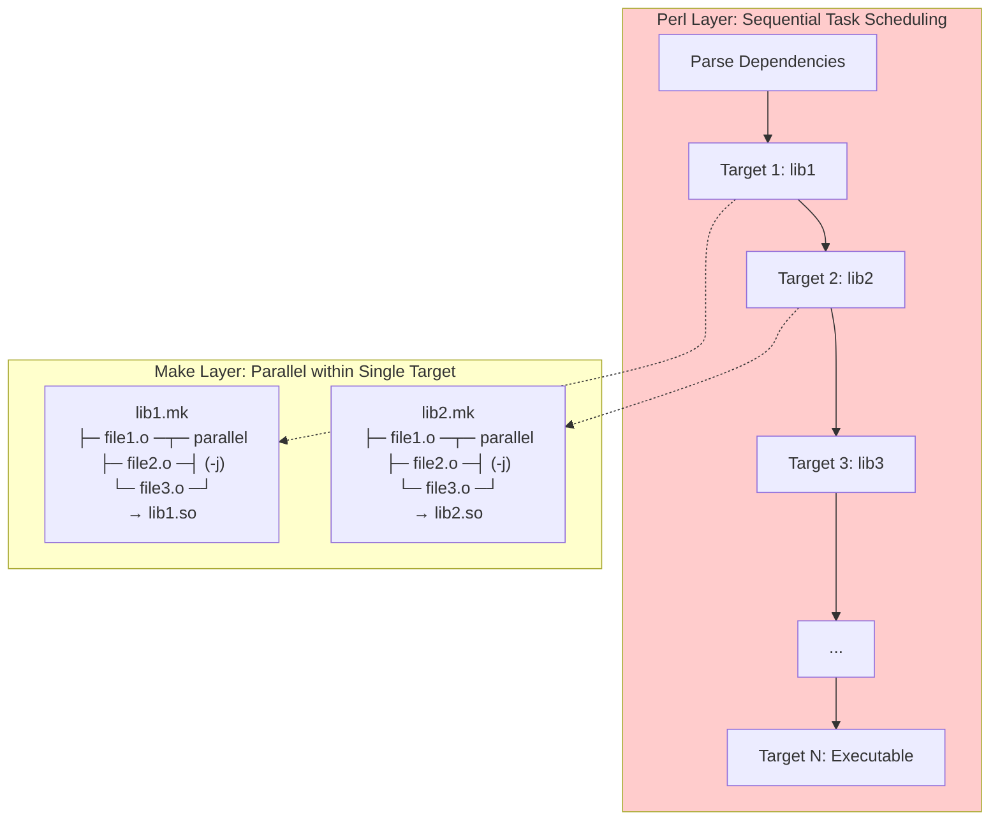
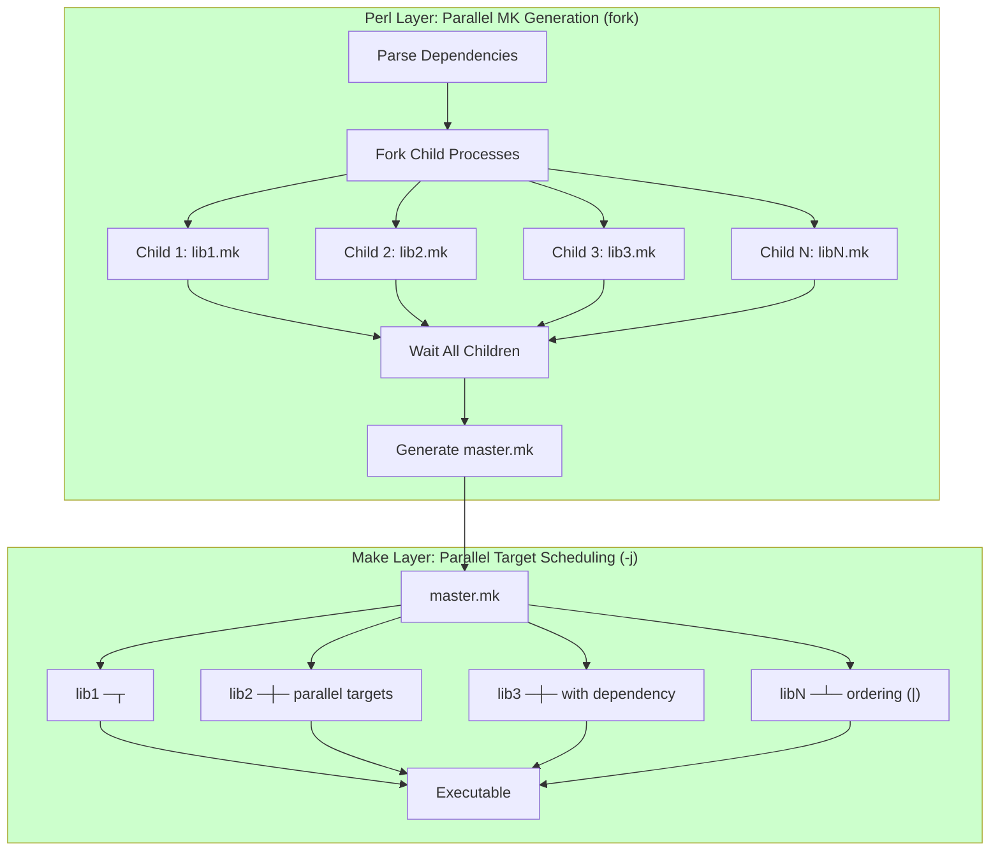

# GMPS Build System Optimizations

## 1 Overview

This document describes optimization enhancements to the **GMPS (Generation Make Production System)** build infrastructure, focusing on parallel compilation, caching, and resource management.

> **Naming Convention:**
> | Term | Full Name | Description |
> |------|-----------|-------------|
> | **GMPS** | Generation Make Production System | The overall build framework |
>
> Originally developed by **Sauerland Soft GmbH (SaSo)** in 1997.
> Key environment variables: `GMPSHOME`, `GMPS_TOP`, `GMPS_PROJECT`, `GMPS_BUILDMODE`

### 1.1 Background

The GMPS build system manages complex C/C++ projects with hundreds of libraries and intricate dependency relationships. The traditional `-cld` (Compile Library Dependencies) option builds dependencies sequentially, which underutilizes modern multi-core systems.

### 1.2 Challenges Addressed

| Challenge                     | Description                                         |
|-------------------------------|-----------------------------------------------------|
| **Sequential Bottleneck**     | Original `-cld` processes libraries one at a time   |
| **Global Variable Pollution** | Perl's global state prevents simple parallelization |
| **Low CPU Utilization**       | Only 15-25% CPU usage on multi-core systems         |
| **No Caching**                | Repeated compilations of unchanged code             |
| **Single Instance**           | Cannot run multiple `gm` commands concurrently      |

### 1.3 Optimizations Implemented

1. **`-cldm` Parallel Build** (Section 2)
   - Fork-based parallel makefile generation
   - Master makefile with dependency graph for GNU Make scheduling
   - Achieves **80-100% CPU utilization** vs 15-25% with `-cld`

2. **Load Factor Control** (Section 3)
   - Fine-grained control over system resource usage
   - Ideal for shared build servers

3. **Multi-Instance Support** (Section 4)
   - Run multiple `gm` commands in parallel without conflicts
   - Enables integration with external build orchestrators

4. **ccache Integration** (Section 5)
   - Compiler cache for instant recompilation of unchanged files
   - 70-99% cache hit rate on incremental builds

## 2. `-cldm` Parallel Build Option
The `-cldm` (Compile Libraries with Dependencies - Master Makefile) option is an optimized parallel build strategy for the GMPS build system. It provides significant performance improvements over the traditional `-cld` option by leveraging both Perl multi-threading for makefile generation and GNU Make's native job scheduling for compilation.

### 2.1 Traditional `-cld` Flow



**ASCII Diagram:**
```
┌─────────────────────────────────────────────────┐
│  Perl Layer: Sequential Task Scheduling         │
│  ┌─────┐   ┌─────┐   ┌─────┐                    │
│  │lib1 │ → │lib2 │ → │lib3 │ → ...              │
│  └──┬──┘   └──┬──┘   └──┬──┘                    │
└─────┼───-─────┼──--─────┼───────────────────────┘
      │         │         │
      ▼         ▼         ▼
┌─────────────────────────────────────────────────┐
│  Make Layer: Parallel within Single Target      │
│  ┌─────────┐  ┌─────────┐  ┌─────────┐          │
│  │.o .o .o │  │.o .o .o │  │.o .o .o │          │
│  │ ↓  ↓  ↓ │  │ ↓  ↓  ↓ │  │ ↓  ↓  ↓ │          │
│  │ lib1.so │  │ lib2.so │  │ lib3.so │          │
│  └─────────┘  └─────────┘  └─────────┘          │
└─────────────────────────────────────────────────┘
```

**Characteristics of `-cld`:**
- Perl schedules targets **sequentially** (one library at a time)
- Within each target, Make can compile `.o` files in **parallel** (`-j`)
- Must wait for lib1 to complete before starting lib2
- Global variable pollution requires complex save/restore logic

**Bottleneck:** CPU cores are underutilized during:
- MK file generation (single-threaded Perl)
- Transitions between targets (idle time)

### 2.2 New `-cldm` Flow



**ASCII Diagram:**
```
┌─────────────────────────────────────────────────┐
│  Perl Layer: Parallel MK Generation (fork)      │
│       ┌─────────┐                               │
│       │  fork   │                               │
│       └────┬────┘                               │
│    ┌───┬───┼───┬───┐                            │
│    ▼   ▼   ▼   ▼   ▼                            │
│  mk1 mk2 mk3 mk4 mkN  → master.mk               │
└─────────────────────────────────────────────────┘
                ↓
┌─────────────────────────────────────────────────┐
│  Make Layer: Parallel Target Scheduling (-j)    │
│  ┌─────┐ ┌─────┐ ┌─────┐ ┌─────┐                │
│  │lib1 │ │lib2 │ │lib3 │ │libN │ → Executable   │
│  └─────┘ └─────┘ └─────┘ └─────┘                │
│     ↑_________|_________|_________↑             │
│          order-only (|) deps                    │
└─────────────────────────────────────────────────┘
```

**Characteristics of `-cldm`:**
- Perl generates **all MK files in parallel** using `fork()`
- Make schedules **all targets in parallel** with dependency ordering
- Order-only prerequisites (`|`) ensure correct build sequence
- Full CPU utilization across all phases

### 2.3 Performance Comparison

#### CPU Utilization Comparison
> Example with (8-core machine, 4 libraries)

**`-cld` CPU Utilization (Low - cores mostly idle):**
```
CPU Core │ Time →
─────────┼──────────────────────────────────────────────────────────────────────
Core 1   │ █░░░░░░░░░░░░░░░█████░░░░░░░░░░░░░░█░░░░░░░░░░░░░░░█████░░░░░░░░░░░░░
Core 2   │ ░░░░░░░░░░░░░░░░█████░░░░░░░░░░░░░░░░░░░░░░░░░░░░░░█████░░░░░░░░░░░░░
Core 3   │ ░░░░░░░░░░░░░░░░█████░░░░░░░░░░░░░░░░░░░░░░░░░░░░░░█████░░░░░░░░░░░░░
Core 4   │ ░░░░░░░░░░░░░░░░█████░░░░░░░░░░░░░░░░░░░░░░░░░░░░░░█████░░░░░░░░░░░░░
Core 5   │ ░░░░░░░░░░░░░░░░░░░░░░░░░░░░░░░░░░░░░░░░░░░░░░░░░░░░░░░░░░░░░░░░░░░░░
Core 6   │ ░░░░░░░░░░░░░░░░░░░░░░░░░░░░░░░░░░░░░░░░░░░░░░░░░░░░░░░░░░░░░░░░░░░░░
Core 7   │ ░░░░░░░░░░░░░░░░░░░░░░░░░░░░░░░░░░░░░░░░░░░░░░░░░░░░░░░░░░░░░░░░░░░░░
Core 8   │ ░░░░░░░░░░░░░░░░░░░░░░░░░░░░░░░░░░░░░░░░░░░░░░░░░░░░░░░░░░░░░░░░░░░░░
─────────┼──────────────────────────────────────────────────────────────────────
Phase    │ gen1 │  compile lib1  │ gen2 │  compile lib2  │ gen3 │ compile lib3 │
         │(1core)│  (4 cores)    │(1core)│  (4 cores)    │(1core)│ (4 cores)   │
```

**`-cldm` CPU Utilization (High - all cores busy):**
```
CPU Core │ Time →
─────────┼────────────────────────────────────────────────────
Core 1   │ █████│███████████████████████████████████│█████████
Core 2   │ █████│███████████████████████████████████│░░░░░░░░░
Core 3   │ █████│███████████████████████████████████│░░░░░░░░░
Core 4   │ █████│███████████████████████████████████│░░░░░░░░░
Core 5   │ █████│███████████████████████████████████│░░░░░░░░░
Core 6   │ █████│███████████████████████████████████│░░░░░░░░░
Core 7   │ █████│███████████████████████████████████│░░░░░░░░░
Core 8   │ █████│███████████████████████████████████│░░░░░░░░░
─────────┼────────────────────────────────────────────────────
Phase    │ gen  │     compile all libs parallel     │  link   │
         │(fork)│         (all 8 cores)             │         │
```

**Legend:** █ = CPU busy, ░ = CPU idle

**CPU Load Factor Gantt Chart (cld vs cldm):**

```mermaid
gantt
    title CPU Load Factor: -cld (max 20%) vs -cldm (max 100%)
    dateFormat HH:mm
    axisFormat %H:%M

    section -cld (max 20%)
    gen1 5%           :a1, 00:00, 1m
    compile1 20%      :a2, after a1, 3m
    gen2 5%           :a3, after a2, 1m
    compile2 20%      :a4, after a3, 3m
    gen3 5%           :a5, after a4, 1m
    compile3 20%      :a6, after a5, 3m
    gen4 5%           :a7, after a6, 1m
    compile4 20%      :a8, after a7, 3m
    link 10%          :a9, after a8, 1m

    section -cldm (max 100%)
    gen all 50%       :b1, 00:00, 2m
    compile all 100%  :crit, b2, after b1, 5m
    link 10%          :b3, after b2, 1m
```




#### Summary

| Metric              | `-cld`                                     | `-cldm`                       |
|---------------------|--------------------------------------------|-------------------------------|
| **CPU Utilization** | ~15-25%                                    | 1%-100% (controlled by input) |
| **Gen MK Phase**    | 1 core (sequential)                        | N cores (fork)                |
| **Compile Phase**   | multiple cores per lib (one lib at a time) | All cores (all libs parallel) |
| **Idle Time**       | High (between targets)                     | Low (continuous work)         |

##### Conclusion

The `-cldm` option represents a significant improvement in the GMPS build system by:

1. **Bypassing Legacy Limitations**: Using `fork()` to isolate global variable state
2. **Leveraging Make's Strengths**: Delegating parallel scheduling to GNU Make

This design achieves **2-30x speedup** depending on the build scenario while maintaining full compatibility with the existing GMS infrastructure.

## 3. Load Factor Control
> Load factor control for shared environments

Users can control system resource usage with the `-l` flag:

```bash
# Full parallel with load limiting
gm UMStppd -cldm -gf -j -gf -l 49.9

# Unlimited parallel jobs
gm UMStppd -cldm -gf -j

# Specific job count
gm UMStppd -cldm -gf -j8
```

**Parameter Passing Enhancement:**
```bash
# Multiple -gf flags supported
gm target -cldm -gf -j -gf -l 99.9 -gf -B
#                ^^^^^  ^^^^^^^     ^^^^^
#                |      |           Force rebuild
#                |      Load average limit
#                Parallel jobs
```

## 4. Multi-Instance Support

The build system now supports multiple simultaneous `gm` invocations:

```makefile
# In your project's Makefile
TARGETS = component1 component2 component3
.PHONY: all $(TARGETS)
all: $(TARGETS)
$(TARGETS):
    gm $@ -cldm -gf -j -gf -l 4.0
# ... can run with make -j4
```

**Implementation:**
- Report files use PID: `/tmp/report_build.$$`
- Temporary files use unique stamps: `/tmp/Imakefile.$stamp`
- No shared state between instances

## 5. Compiler Cache Integration (ccache)
> **ccache** (compiler cache) is a tool that speeds up C/C++ recompilation by caching previous compilation results. When the same source file is compiled again with the same flags, ccache returns the cached result instead of running the actual compiler.

### 5.1 Enabling ccache in gms_make

```bash
# Enable ccache for all compilation
export ENABLE_CCACHE=yes
gm UMStppd -cldm -j
# Enable ccache for one compilation
ENABLE_CCACHE=yes gm UMStppd -cld

# Check ccache statistics
ccache -s
# Clear cache if needed
ccache -C
```

**Environment variables:**
| Variable | Description |
|----------|-------------|
| `ENABLE_CCACHE=yes` | Enable ccache wrapper for gcc/g++ |
| `CCACHE_DIR` | Cache directory (default: `~/.ccache`) |
| `CCACHE_MAXSIZE` | Maximum cache size (e.g., `10G`) |
| `CCACHE_COMPRESS` | Enable compression (saves disk space) |

**Typical cache hit rates:**
- First build: 0% (cache is empty)
- Incremental build (few changes): 90-99%
- Clean rebuild (same code): 95-100%
- After branch switch: 70-90%

## 6 Gold Linker Attempt (Not Working)

Attempted to replace the default GNU `ld` linker with the **gold** linker for faster link times.

**Configuration in `gmps/etc/ims/rhlinux/gms_config`:**
```bash
# Uncomment to enable gold linker (currently disabled due to errors)
#@flags_global   @GLDFLAGS64     -fuse-ld=gold
#@flags_global   @GLDFLAGS32     -fuse-ld=gold
```

**Why gold is faster:**
- Written in C++ with better data structures
- Multi-threaded linking support
- Typically 2-5x faster than traditional `ld`

**Actual error when building UMStppd with gold:**
```
/bin/ld.gold: warning: skipping incompatible /home/.../ims_cmrepo/lib/libnem.so while searching for nem
/bin/ld.gold: warning: skipping incompatible /home/.../ims_tools/icm/lib/libnem.so while searching for nem
/home/.../libUMScommon.so: error: undefined reference to 'inflateInit2_'
/home/.../libUMScommon.so: error: undefined reference to 'deflateInit2_'
collect2: error: ld returned 1 exit status
```

**Root causes:**
1. **Architecture mismatch**: Some 32-bit libraries in 64-bit library paths (gold is stricter than ld)
2. **Missing `-lz`**: zlib dependency not explicitly linked (traditional ld resolves this implicitly)
3. **Implicit symbol resolution**: gold requires explicit dependency ordering

**Future work:**
- Standardize linker flags across all `.gmk` files
- Add missing explicit library dependencies (`-lz`)
- Separate 32-bit and 64-bit library paths properly

## 7. Usage Examples

### 7.1 Basic Usage

**RECOMMENDED:** `-cldm` be used with `-gf -j` for parallel compilation!

```bash
# Parallel build with dependency resolution (use the full performance of the system)
gm UMStppd -cldm -gf -j

# With load limiting (recommended for shared machines)
gm UMStppd -cldm -gf -j -gf -l 37.8

# Parallel clean
gm UMStppd -cldm -clean -gf -j
```

**What happens without `-gf -j`:**
- The `master.mk` is still generated correctly
- Makefile generation still uses parallel fork (4 processes by default)
- **BUT** compilation runs sequentially (no `-j` passed to gmake)
- You lose the main performance benefit of `-cldm`

### 7.2 With Dependency Tree Generation

```bash
# Enable dependency tracking for analysis
DEP_TREE=yes gm UMStppd -cldm -gf -j
```
## 8. Appendix: Key Innovations

### 8.1 Parallel Makefile Generation with Perl Fork

The GMPS build system had a design limitation: global variables were heavily used, requiring complex save/restore operations when generating multiple `.mk` files sequentially.

**Solution:** Use Perl `fork()` to generate `.mk` files in parallel child processes.

```perl
# Each child process has isolated memory space
foreach my $info (@target_info) {
    my $pid = fork();
    if ($pid == 0) {
        # Child process - isolated global variables
        &pre_generate_mk_file($tgt, ...);
        exit(0);
    }
}
```

**Benefits:**
- Each forked process has its own copy of global variables
- No need for complex save/restore logic
- Parallel generation utilizing multiple CPU cores
- Clean process isolation prevents variable pollution

### 8.2 Master Makefile with Dependency Graph

Instead of controlling build order in Perl, we delegate it to GNU Make:

```makefile
# master.mk - Generated with PHONY targets and order-only prerequisites
.PHONY: all libA libB libC UMStppd

all: UMStppd

# Libraries without dependencies
libA:
    @cd /path && $(MAKE) -r libA -f libA.mk

# Libraries with dependencies (order-only |)
libB: | libA
    @cd /path && $(MAKE) -r libB -f libB.mk

# Main target depends on all libraries
UMStppd: | libA libB libC
    @cd /path && $(MAKE) -r UMStppd -f UMStppd.mk
```

**Design Decisions:**

| Feature                         | Implementation                | Reason                                                    |
|---------------------------------|-------------------------------|-----------------------------------------------------------|
| PHONY targets                   | All library targets are PHONY | Ensures sub-make always runs to check source file changes |
| Order-only prerequisites (`\|`) | `libB: \| libA`               | Guarantees build order without timestamp comparison       |
| Parallel execution              | `gmake -j`                    | Let Make's scheduler handle parallelism                   |

